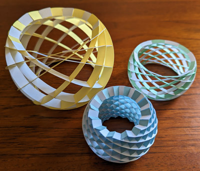

# inkscape_sliceforms

A collection of [Inkscape](https://inkscape.org/) [extensions](https://inkscape.org/gallery/=extension/) that generate sliceform templates.

This project has template generators for four sliceform models: a torus, a cylinder, a hyperboloid of one sheet, and a truncated sphere. All models are based on the paper [Building a torus with Villarceau sections](http://www.heldermann-verlag.de/jgg/jgg15/j15h1mone.pdf) by María García Monera and Juan Monterde, and [sample templates](https://www.uv.es/monera2/) published by María García Monera.

## Installing the extensions

1. Install [Inkscape](https://inkscape.org/). The extensions are tested with Inkscape 1.2.2.
2. Download this project's [latest release](https://github.com/fdxmw/inkscape_sliceforms/releases/download/r0.3/inkscape_sliceforms-installable-r0.3.1.zip).
   > If you are browsing GitHub's Releases page, download the `-installable-` `.zip` file, and not the `Source code` `.zip` file. The `Source code` `.zip` file is not usable by itself, because it does not include the [inkscape_common](https://github.com/fdxmw/inkscape_common) submodule.
3. Unzip the latest release into Inkscape's "User extensions" directory. The location of this directory can be found in Inkscape's Settings dialog box, under `System > User extensions`.
   > If you previously installed an older release, delete the old release's directory from your inkscape extensions directory, otherwise you will have multiple copies of each extension.
4. Restart Inkscape.

If installation succeeded, you should see four new Inkscape menu items:

1. `Extensions > Sliceforms > Cylinder Templates`
1. `Extensions > Sliceforms > Hyperboloid Templates`
1. `Extensions > Sliceforms > Torus Templates`
1. `Extensions > Sliceforms > Truncated Sphere Templates`

## Using the extensions

Select an extension from the `Extensions > Sliceforms` menu. A dialog box should appear, with options to specify the model's dimensions. These dialog boxes have a `Help` tab with recommended settings. The default settings should work well for 110lb (200GSM) cardstock.

### Choosing model dimensions

Generally, models are easier to assemble when they are shorter, use thinner slices, and have larger central holes:

1. Reducing a model's height lowers the slice intersection angle. As the slice intersection angle increases, the model will prefer to collapse into a flat stack of slices, rather than holding its three-dimensional shape. Try to keep the slice intersection angle (`loxodromic_angle` in the code) below 45°.
1. Thinner slices are more flexible. Assembling these models requires bending the slices, and thinner slices are much more flexible than thicker slices. Slice widths around 1 centimeter usually work well.
1. It helps to have easy access to all sides of the model during assembly. Models with large central holes give you access to the center of the model. Try to keep the inner radius above two centimeters.

All extensions have these two parameters:

1. Thickness of material. The extensions calculate the width of each slot from the material thickness, so it is important to set the material thickness to the actual thickness of your cardstock.
1. Width of material. This setting just helps you use material more efficiently. The material width determines how many template copies placed in a row, before starting a new row. Note that this is the *usable* material width, which is smaller than the actual material width.
   > For example, with a Cricut cutting machine it is best to avoid cutting within .25″ of the material's edge, so the usable width of a 8.5″ x 11″ sheet of cardstock is actually 8″ (8.5″ - .25″ - 25.″).

The cylinder and truncated sphere models have a 'Slice shape' option. The 'C' option much easier to assemble. The 'Ring' option is more difficult to assemble, because each slice has a unique pattern of slots, and the slices must be assembled in a specific order, and it is much easier to accidentally tear the paper during assembly. The green and white truncated sphere in the images above was assembled from ring-shaped slices; all the other cylinders and spheres were assembled from C-shaped slices.

## Making slices

To make a model, you will need cardstock and a cutting tool.

### Cardstock

I use 110 lb index cardstock (200 GSM), usually "Neenah Index Cardstock" from Amazon.com. You will need to slightly bend the cardstock during assembly, so extremely rigid materials like solid wood or metal will not work.

### Cutting cardstock

For a stronger model, arrange the templates on the cardstock so most of the slots are perpendicular to the grain of the cardstock. The extensions assume that the grain runs vertically.

> For example, the grain for Neenah cardstock runs in the longer dimension of the cardstock. The extensions assume the grain is vertical, so orient the cardstock with the longer dimension vertical ("portrait").

#### Cutting cardstock with a machine

If you have access to a cutting machine, like a Cricut, Silhouette, Glowforge or similar, you can send the templates directly to the cutting machine. I use a Cricut. Cutting machines work best, as the cuts are small and precision is important.

> When loading an Inkscape SVG file in another program, like Cricut Design Space, always double check the dimensions. [Units In Inkscape](https://wiki.inkscape.org/wiki/Units_In_Inkscape) has more background on this debacle.

> The extensions assume zero kerf. Kerf is the amount of material removed by the cutting tool. Most cutting tools appropriate for cardstock have effectively zero kerf except laser cutters. If you need to compensate for kerf, you can do it in Inkscape by [combining the `Stroke to Path` and `Break Apart` tools](https://wiki.hal9k.dk/equipment/lasersaur/inkscape-kerf).

#### Cutting cardstock manually

If you don't have access to a cutting machine, you can print the templates on the cardstock and cut them out manually with scissors or a knife.

> Before printing the templates, remove the fill colors (yellow and blue), unless you want to print the fill colors, and change the stroke color from red to black.

> When cutting manually, it is important to cut *all* sides of each slot. Specifically, you can not make only one cut in the middle of the slot. The slot width accounts for the thickness of the cardstock, and if the slot width is incorrect the slices will not fit together properly.

## Assembling the slices

To assemble these models, refer to María García Monera's videos:

* [Torus Assembly Video](https://www.youtube.com/watch?v=WVE-HeVFJ1k)
* [Cylinder Assembly Video](https://www.youtube.com/watch?v=QfBc0fR64EQ)

The videos are in Spanish, but Youtube's auto-translated captions work well.

There currently is no assembly video for the hyperboloid of one sheet or the truncated sphere, but the assembly processes are very similar to the cylinder.

In the assembly videos, María recommends setting aside two slices of the outer templates, expanding the model from a flat stack of slices to a three-dimensional model, then finally adding the two set-aside outer templates to the three-dimensional model. I've found it helps to set aside as many outer slices as possible. With `N` slices, try setting aside `(N - 2) / 2` outer slices.

Models with ring slices follow a different assembly process; here is [a basic guide](ring-assembly.md).
