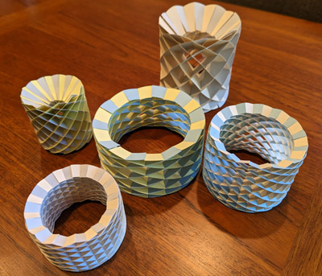

# inkscape_sliceforms

A collection of [Inkscape](https://inkscape.org/) [extensions](https://inkscape.org/gallery/=extension/) that generate sliceform templates.

This project has template generators for three models: a torus, a cylinder, and a hyperboloid of one sheet. All models are based on the paper [Building a torus with Villarceau sections](http://www.heldermann-verlag.de/jgg/jgg15/j15h1mone.pdf) by María García Monera and Juan Monterde, and [sample templates](https://www.uv.es/monera2/) published by María García Monera.

## Installation

1. Install [Inkscape](https://inkscape.org/).
2. Download this project's [latest release](https://github.com/fdxmw/inkscape_sliceforms/releases/download/r0.2/inkscape_sliceforms-installable-r0.2.zip).
   - If you are browsing GitHub's Releases page, be sure to download the `-installable-` `.zip` file, and not the `Source code` `.zip` file. The `Source code` `.zip` file is not usable by itself, because it is missing the [inkscape_common](https://github.com/fdxmw/inkscape_common) submodule.
3. Unzip the latest release into Inkscape's "User extensions" directory. The location of this directory can be found in Inkscape's Settings dialog box, under `System > User extensions`.
   - If you previously installed an older release (`inkscape_sliceforms-installable-r0.1`), delete the old release's directory from your inkscape extensions directory, otherwise you will have multiple copies of each extension.
4. Restart Inkscape.

If installation succeeded, there should be three new Inkscape menu items:

1. `Extensions > Sliceforms > Cylinder Templates`
1. `Extensions > Sliceforms > Hyperboloid Templates`
1. `Extensions > Sliceforms > Torus Templates`

## Using The Extensions

Select an extension from the `Extensions > Sliceforms` menu. A dialog box should appear, with options to specify the model's dimensions. These dialog boxes have a `Help` tab with recommended settings. The default settings should work well. Generally, models are easier to assemble when they:

1. Are shorter in height (flatter tori, shorter cylinders and hyperboloids),
1. Have thinner slices (shorter distance from a slice's left side to its right side), and
1. Have larger central holes.

## Making The Models

To make the models, you will need cardstock and cutting tools.

### Cardstock

I use 110 lb index cardstock (200 GSM), usually "Neenah Index Cardstock" purchased from Amazon.

### Cutting The Cardstock

If you have access to a cutting machine (Cricut, Silhouette, Glowforge or similar), you can send the template patterns directly to the cutting machine. I use a Cricut. Cutting machines work best, as the cuts are small and precise.
- When loading an Inkscape SVG file in another program (like Cricut Design Space), double check the dimensions. For background on this debacle, see [Units In Inkscape](https://wiki.inkscape.org/wiki/Units_In_Inkscape).

If you don't have access to a cutting machine, you can print the templates on the cardstock and cut them out with scissors or a knife.

- Remove the fill colors (yellow and blue) from the templates, unless you want to print the fill colors.
- When cutting with scissors, it is important to cut *all* sides of each slot. It is important to account for the thickness of the cardstock, otherwise the templates will not slot together properly.

### Assemble The Model

To assemble these models, refer to María García Monera's videos:

* [torus assembly](https://www.youtube.com/watch?v=WVE-HeVFJ1k)
* [cylinder assembly](https://www.youtube.com/watch?v=QfBc0fR64EQ)

The videos are in Spanish, but Youtube's auto-translated captions work well.

There currently is no assembly video for the hyperboloid of one sheet, but the process is very similar to the cylinder.
