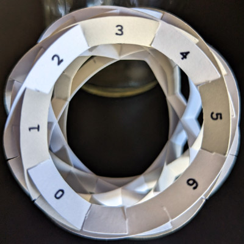

# Assembling models with ring slices

Models with ring slices are very difficult to assemble. It helps to assemble the same model with 'C'-shaped slices first, to get a better sense of how the pieces fit together. The following pictures show the assembly process for a truncated sphere model, using [these sample templates](images/ring-slices.pdf).

## Slice templates

To follow this guide, it is important to number and orient the templates as shown in the sample templates.

Start by studying the sample templates. Note how the templates are rotationally symmetric: rotating any slice by 180 degrees results in the same shape. But most templates are not horizontally or vertically symmetric, because the distances between slots are smaller at the top and bottom of each slice, and larger at the left and right side of each slice.

Yellow slices have even numbers, starting from 0, and blue slices have odd numbers starting from 1. There are a total of 8 slices, numbered 0-7, and each slice has a unique number.

Each slice's number equals the number of inward-facing slots immediately to the left of the number at the top of each ring. For example:
* Yellow slice 2 has two inward-facing slots immediately to the left of the number 2 at the top of the yellow ring.
* Blue slice 5 has five inward-facing slots immediately to the left of the number 5 at the top of the blue ring.

Print the numbers on each ring to follow along with these assembly instructions. You could also just write the number on each ring with a pen, but be sure to write the number in the correct position at the top of each ring.

## Making the sample slices

The image below shows the slices after cutting and labeling each ring. The slices are sorted by slice number, and a Cricut wrote the numbers on each ring with its pen holder attachment.

## Assembly

The following pictures shows how the slices are assembled. We start with slice 0, then add slice 1, up to slice 7, always moving clockwise.

Note how the assembled model only has outward-facing empty slots at each step. This means that when we add a new slice, *all* of its inward-facing slots must engage with the model's outward-facing slots.

Each ring should be planar (flat, with no bend or curl). You will need to significantly bend and stretch the cardstock during assembly, but you should be able to straighten out each slice after it has been fully seated into all of its slots.

Be especially careful with slice 6, it is very easy to insert it into the wrong slots. Make sure the slice is completely flat after it's been added to the model.
