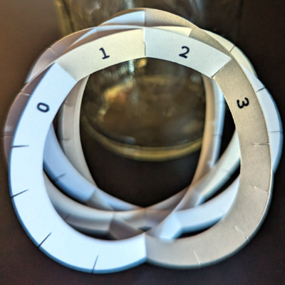
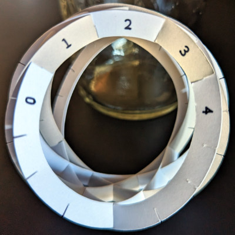
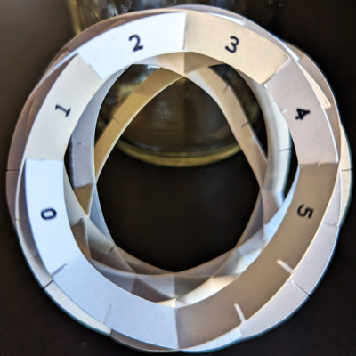

# Assembling models with ring slices

Models with ring slices are very difficult to assemble. It helps to assemble the same model with 'C'-shaped slices first, to get a better sense of how the pieces fit together. The following pictures show the assembly process for a truncated sphere model, using [these sample templates](images.ring-slices.pdf).

Note how the slice templates are numbered: Yellow slices have even numbers, starting from 0, and blue slices have odd numbers starting from 1. There are 8 slices, numbered 0-7, and each slice has a unique number.

Each slice's number equals the number of inward-facing slots immediately to the left of the number at the top of each ring. Examples:
* Yellow slice 2 has two inward-facing slots immediately to the left of the number 2 at the top of the yellow ring.
* Blue slice 5 has five inward-facing slots immediately to the left of the number 5 at the top of the blue ring.

Print the numbers on each ring to follow along with these assembly instructions. You can also just write the number on each ring with a pen, but be sure to write the number in the correct position at the top of the ring.

## The slices

The image above shows the slices after cutting and labeling each ring. These slices are sorted by slice number. A Cricut's pen holder was used to write the numbers on each ring.

## Assembly

The following pictures shows how the slices are assembled. We start with slice 0, then add slice 1, up to slice 7. At each step, the assembled model only has outward-facing slots, and each ring should be flat (no bend or curl). You will need to significantly bend and stretch the cardstock during assembly.

Be especially careful with slice 6, it is very easy to insert it into the wrong slots.
